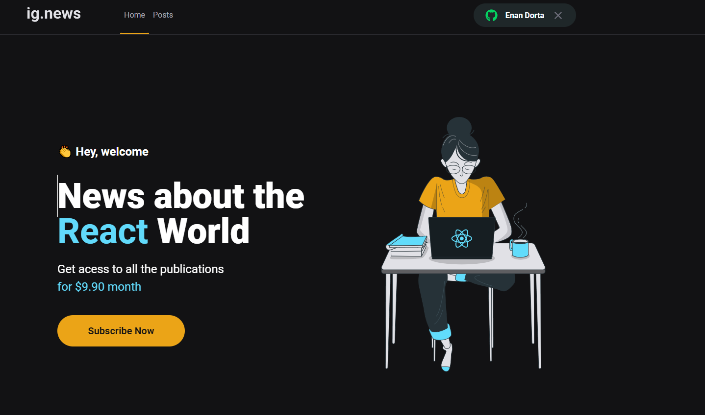
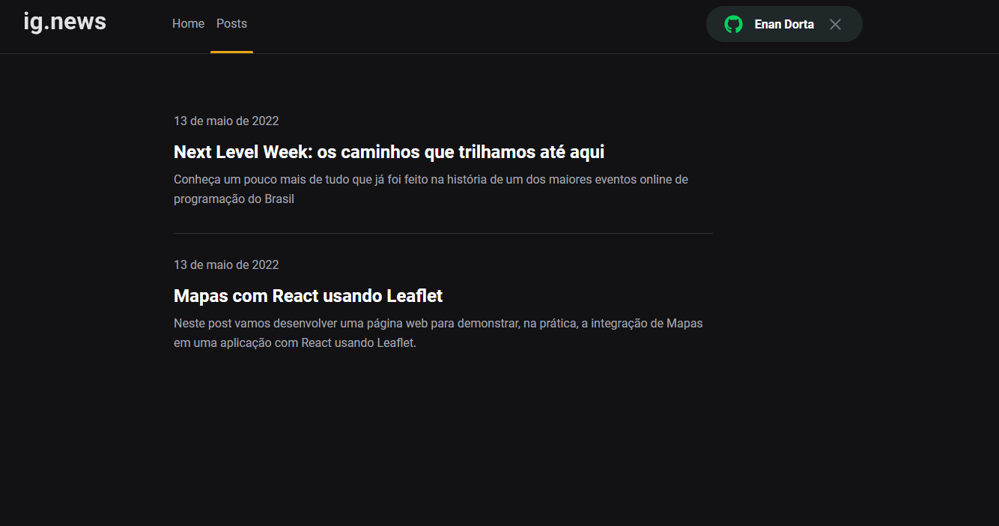
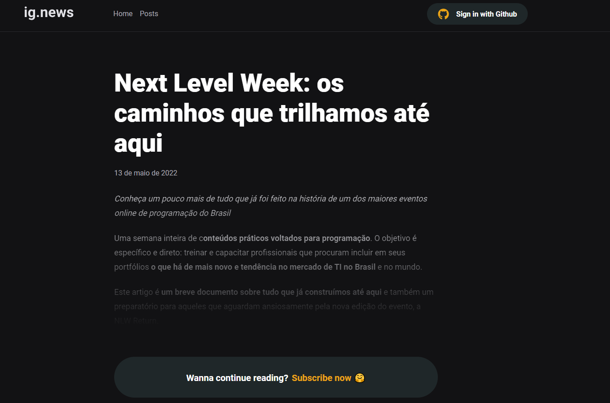
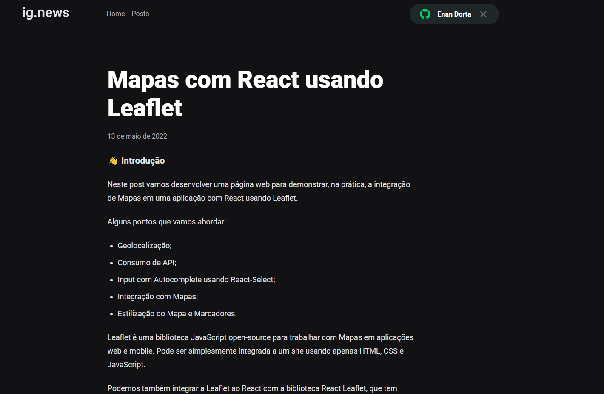

<h1 align="center">
  Ignews
</h1>

- - -

<h1 align="center" >Preview</h1>

 
  

 
  

 
  

 
  

 

## Tecnologias

 Esse projeto foi desenvolvido com as seguintes tecnologias:

- NEXTJS
- SCSS
- STRIPE
- PRISMIC
- FAUNADB
  

## Projeto

 Caso queira rodar essa aplicação em sua máquina, basta usar os comandos: 

 - yarn 
 - yarn run dev